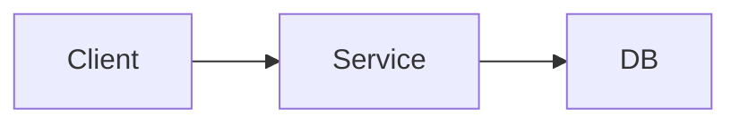

# Documentation Templates Library

此文件提供项目文档的共享模板库，用于支持 `specify -> plan -> docs` 的完整链路。AI Agent 在创建、更新或重构文档时，应优先参考以下模板结构，确保核心要素齐全，但应根据任务阶段与项目现状灵活裁剪，保持文档实用。

## 使用说明
- `spec/`：阶段性工作区，用于需求澄清、开放问题、设计草稿与实施计划。
- `docs/`：稳定成果与长期知识库，用于沉淀产品、技术、规范与运行信息。
- `docs/dev_status/`：过程状态文档，用于记录当前进展、阻塞项、下一步与历史留痕。
- 小任务或阶段内小更新时，优先做最少必要记录；不要为了“模板完整”而机械补全所有章节。
- 所有时间统一使用格式：`YYYY-MM-DD HH:MM`。
- 不记录真实密钥、Token、私钥或生产数据；示例使用占位符。

## 🧭 1. Spec Workspace Templates（阶段性工作区模板）

### 1.1 Requirements Draft（需求草案）
**文件路径**: `spec/features/<feature-key>/01_requirements.md`

```
# [Feature Name] Requirements Draft
> Last Updated: [YYYY-MM-DD HH:MM]
> Status: Draft

## 1. Background (背景)
> 为什么要做这件事？当前痛点或业务背景是什么？

## 2. Goal (目标)
- 目标 1
- 目标 2

## 3. In Scope (范围内)
- 要做：...
- 要支持：...

## 4. Out of Scope (范围外)
- 不做：...
- 暂不考虑：...

## 5. User Scenarios (用户场景)
- 作为 [角色]，我希望 [动作]，以便 [价值]

## 6. Inputs / Outputs (输入输出)
- Input:
- Output:
- Example:

## 7. Constraints (约束)
- 平台：
- 性能：
- 权限：
- 依赖：

## 8. Assumptions (假设)
- 假设 1
- 假设 2
```

### 1.2 Acceptance Draft（验收草案）
**文件路径**: `spec/features/<feature-key>/02_acceptance.md`

```
# [Feature Name] Acceptance Draft
> Last Updated: [YYYY-MM-DD HH:MM]
> Status: Draft

## 1. Acceptance Criteria (验收标准)
- [ ] 条件 1
- [ ] 条件 2
- [ ] 条件 3

## 2. Non-goals (非目标)
- 不要求：...
- 不覆盖：...

## 3. Verification Notes (验证说明)
- 建议验证方式：
- 关键观察点：

## 4. Done Definition (完成定义)
- 功能已实现
- 文档已同步
- 测试状态已记录
```

### 1.3 Open Questions（未决问题）
**文件路径**: `spec/features/<feature-key>/03_open_questions.md`

```
# [Feature Name] Open Questions
> Last Updated: [YYYY-MM-DD HH:MM]
> Status: Open

## Open Items
| ID | Question | Why it matters | Current assumption | Owner / Next step |
|----|----------|----------------|--------------------|-------------------|
| Q1 | ...      | ...            | ...                | ...               |
| Q2 | ...      | ...            | ...                | ...               |
```

### 1.4 Design Draft（设计草案）
**文件路径**: `spec/features/<feature-key>/04_design.md`

```
# [Feature Name] Design Draft
> Last Updated: [YYYY-MM-DD HH:MM]
> Status: Draft

## 1. Overview (概述)
> 方案要解决什么问题。

## 2. Options Considered (候选方案)
- 方案 A：优点 / 缺点
- 方案 B：优点 / 缺点

## 3. Proposed Design (建议方案)
- 核心思路：
- 关键流程：
- 数据或接口变化：

## 4. Risks (风险)
- 风险 1
- 风险 2

## 5. Open Points (待确认点)
- ...
```

### 1.5 Implementation Plan（实施计划）
**文件路径**: `spec/features/<feature-key>/05_plan.md`

```
# [Feature Name] Implementation Plan
> Last Updated: [YYYY-MM-DD HH:MM]
> Status: Draft

## 1. Why / What
- Why:
- What:

## 2. File Changes (文件变更)
- `path/to/file`: ...
- `path/to/file`: ...

## 3. Implementation Steps (实施步骤)
1. ...
2. ...
3. ...

## 4. Test Plan (验证计划)
- 命令：
- 预期：
- 状态：UNVERIFIED / BROKEN / VERIFIED

## 5. Risks & Rollback (风险与回滚)
- 风险：
- 回滚方式：
```

## 📋 2. Project Index (项目地图)

**文件路径**: `docs/00_project_index.md` **用途**: 核心入口，Agent 启动时优先读取。

```
# [Project Name] Context Map
> Last Updated: [YYYY-MM-DD HH:MM]

## 1. Project Overview (项目简介)
> 一句话清晰描述项目的核心价值和目标用户。

## 2. Documentation Navigation (文档导航)
> Agent 请注意：在回答问题前，优先通过此索引定位详细文档。

### 📘 Product & Requirements (产品)
- **[Requirements] (product/requirements.md)**: 当前生效的 PRD 和功能列表。
- **[Domain Terms] (product/domain_terms.md)**: 业务术语表。

### 🏗️ Technical Architecture (技术)
- **[Architecture] (tech/architecture.md)**: 系统设计、技术栈与拓扑图。
- **[API Specs] (tech/api_specs.md)**: 关键接口约定。
- **[Database] (tech/database.md)**: 数据库模型与设计。

### 🛠️ Guides & Norms (规范与指南)
- **[Development] (guide/development.md)**: 开发环境搭建与常用命令。
- **[Conventions] (guide/conventions.md)**: 代码风格与命名规范。
- **[Testing] (guide/testing.md)**: 测试策略与覆盖率要求。

### 🚦 Development Status (状态)
- **[Active Task] (dev_status/active_task.md)**: 当前正在进行的上下文（实时更新）。
- **[Todo List] (dev_status/todo.md)**: 待办事项与积压想法。
- **[History Log] (dev_status/history_log.md)**: 已完成任务流水账。

## 3. Key Environment Variables (关键环境)
- `ENV_TYPE`: (dev/prod)
- (列出其他关键开关，不要包含真实密钥)
```

## 🚧 3. Active Task Context (当前任务状态)

**文件路径**: `docs/dev_status/active_task.md` **用途**: 记录“存档点”，保证对话中断后能无缝恢复。

**轻量更新建议**:
- 对于实现过程中的小阶段同步，只需更新 `Current Objective`、`Progress Checklist`、`Known Issues / Blockers`、`Next Actions`。
- 只有在任务复杂、即将中断、需要交接或上下文发生明显变化时，才完整重写 `Context Dump`。

```
# Active Task Context (Live State)
> Last Updated: [YYYY-MM-DD HH:MM]

## 🎯 Current Objective (当前目标)
> 一句话描述当前正在解决的核心问题。

## 🧩 Context Dump (关键上下文)
> 列出解决此问题必须关注的文件、变量或关键事实。
- **相关文件**: `src/xxx.py`, `docs/xxx.md`
- **最近修改**: 修改了函数 X 的逻辑...

## 🚧 Progress Checklist (进度)
- [x] 已完成步骤 A
- [ ] 正在进行步骤 B  <-- **Current Focus**
- [ ] 待执行步骤 C

## 💥 Known Issues / Blockers (遇到的阻碍)
> 如有错误，粘贴关键日志或简要说明阻塞原因。
- **Error**: ...
- **Attempted**: 尝试了方案 A，但失败，原因是...

## ⏭️ Next Actions (下一步计划)
1. 具体动作 1
2. 具体动作 2
```

## 📄 4. Product Requirement (PRD)

**文件路径**: `docs/product/requirements.md`（或子功能文档） **命名建议**: 保持语义化，不带编号。

```
# [Feature Name] Product Requirements
> Last Updated: [YYYY-MM-DD HH:MM]

## 1. Background & Value (背景与价值)
- **User Story**: 作为 [角色]，我想要 [动作]，以便 [价值]。
- **Priority**: P0 / P1 / P2

## 2. Functional Requirements (功能需求)
| ID | Feature Point | Description | Acceptance Criteria |
|----|---------------|-------------|---------------------|
| F1 | 登录验证      | 支持 JWT 校验 | Token 过期需返回 401 |
| F2 | ...           | ...         | ...                 |

## 3. Edge Cases (边界情况)
- 网络异常时的表现？
- 数据为空时的 UI 状态？

## 4. UI/UX Reference (交互)
- (可选) 描述页面跳转逻辑或引用设计图链接。
```

## ⚙️ 5. Technical Design (技术设计)

**文件路径**: `docs/tech/designs/xxx_design.md` 或 `docs/tech/architecture.md` **命名建议**: 保持语义化，不带编号。

```
# [Module Name] Technical Design
> Last Updated: [YYYY-MM-DD HH:MM]

## 1. Overview (概述)
> 简述该模块的技术职责。

## 2. Data Flow (数据流向)


## 3. Data Structures (数据结构)
- **Table**: `table_name`
  - `col1`: Type (Description)

## 4. Interface Design (接口设计)
- **Function**: `process_data(input: Dict) -> bool`
- **API**: `POST /api/v1/submit`
```

## 🐛 6. Issue / Bug Report
**文件路径**: `docs/issues/YYYY-MM-DD-issue-name.md`
**命名建议**: 使用日期前缀以便排序。

```markdown
# Issue: [简短描述错误现象]
> Date: [YYYY-MM-DD]

## 1. Environment (环境)
- OS: Windows/Linux/Mac
- Version: v1.2.0

## 2. Symptom (现象)
> 描述发生了什么，预期应该发生什么。

## 3. Reproduction Steps (复现步骤)
1. Go to page X
2. Click button Y

## 4. Root Cause Analysis (原因分析)
> (由 Agent 填写) 经过排查，发现是 ... 导致的。

## 5. Resolution (解决方案)
- [ ] 修复代码 A
- [ ] 增加测试用例 B
```

## 🏛️ 7. ADR (Architecture Decision Record)

**文件路径**: `docs/adr/001-title.md` **命名建议**: 使用递增编号（001, 002...）。

```
# ADR-[编号]: [简短标题]
> Date: [YYYY-MM-DD]

## Status
[Draft / Accepted / Deprecated]

## Context (背景)
我们在面临什么问题？有哪些选项？

## Decision (决策)
我们决定使用 [方案 X]。

## Consequences (后果)
- **Positive**: 性能提升，生态更好。
- **Negative**: 运维成本增加，内存占用更高。
```

## 🛠️ 8. Development Manual (开发手册)

**文件路径**: `docs/guide/development.md`

```
# Development Guide (开发指南)
> Last Updated: [YYYY-MM-DD HH:MM]

## 1. Quick Start Commands (常用命令)
> AI 请注意：执行任务时优先使用以下命令。
- **Start Server**: `npm run dev`
- **Run Tests**: `npm test` (or `pytest`)
- **Lint/Format**: `npm run lint`
- **DB Migration**: `npm run migrate`

## 2. Environment Variables (环境变量)
| Variable | Required | Description | Example |
|----------|----------|-------------|---------|
| `DB_URL` | Yes | Postgres 连接字符串 | `postgres://...` |
| `API_KEY`| No  | 第三方服务密钥 | `sk-123...` |

## 3. Deployment Flow (部署流程)
- `main` 分支自动部署到 Production 环境。
- Docker 构建命令: `docker build -t app .`
```

## 📏 9. Coding Conventions (代码规范)

**文件路径**: `docs/guide/conventions.md`

```
# Coding Standards (代码规范)

## 1. Naming Conventions (命名规范)
- **Files**: `snake_case.py` / `kebab-case.ts`
- **Classes**: `PascalCase`
- **Variables/Functions**: `snake_case` (Python) / `camelCase` (JS/TS)
- **Constants**: `UPPER_CASE`

## 2. Architecture Patterns (架构模式)
- 数据库访问层优先使用 **Repository Pattern**。
- Controller 层不应包含业务逻辑，请将其移动到 Service 层。

## 3. Error Handling (错误处理)
- 使用项目定义的自定义异常类。
- 避免捕获通用 `Exception` 后直接吞掉错误。

## 4. Tech Constraints (技术限制)
- **Libraries**: 优先使用 `dayjs` 而非 `moment`。
- **Async**: 优先使用 `async/await`，避免使用 `.then()` 链式调用。
```

## 🧪 10. Testing Strategy (测试策略)

**文件路径**: `docs/guide/testing.md` **用途**: 核心测试协议。若项目已有现成测试规范，优先遵循项目规则；若没有，可参考以下结构。

```
# Testing Strategy (测试策略)

## 1. Storage & Structure (存储与结构)
- **Root Directory**: 默认建议将测试代码放在项目根目录 `tests/` 下。
- **Mirror Structure**: 若项目没有现成规范，建议 `tests/` 目录镜像 `src/`（或 `app/`）结构，便于定位。
    - **Example**:
        - Source: `src/utils/data_parsers.js`
        - Test: `tests/utils/data_parsers.test.js`
    - **Helpers**: 测试专用辅助函数或固件（Fixtures）可存放在 `tests/helpers/` 或 `tests/fixtures/` 中。

## 2. Naming Conventions (命名规范)
- **File Naming**:
    - **JavaScript/TypeScript**: 使用 `[feature].test.ts` 或 `[feature].spec.ts`。
    - **Python**: 使用 `test_[feature].py` 以确保被 pytest 自动发现。
    - **Example**: `auth_service.test.ts` 对应 `auth_service.ts`。
- **Test Function Naming**: 测试函数或用例名应清晰描述被测行为和预期结果。

## 3. Test Stack (技术栈)
- **Framework**: 根据项目语言选择标准框架（如 Python 的 `pytest`，Node.js 的 `jest` 或 `vitest`）。
- **Mocking & Isolation**:
    - **原则**: 单元测试应尽量隔离外部依赖（如数据库、第三方 API、文件系统）。
    - **工具**: 使用框架自带的 Mock 功能模拟外部交互。
    - **Scope**: 集成测试可按需连接真实的测试数据库或服务容器。

## 4. Execution Rules (执行规则)
- **Self-Contained (自包含)**: 每个测试文件应尽量独立运行，避免依赖其他测试文件的执行顺序。
- **Command**: 建议配置统一的入口命令，支持一键从根目录运行测试。
    - Node: `npm test`
    - Python: `pytest` or `make test`
- **Timing (执行时机)**:
    - **开发阶段**: 在功能代码实现和文档修正之后，及时编写并运行必要测试作为验证。
    - **提交阶段**: 在提交代码或标记任务完成前，运行适当范围的测试并确认结果。
```
